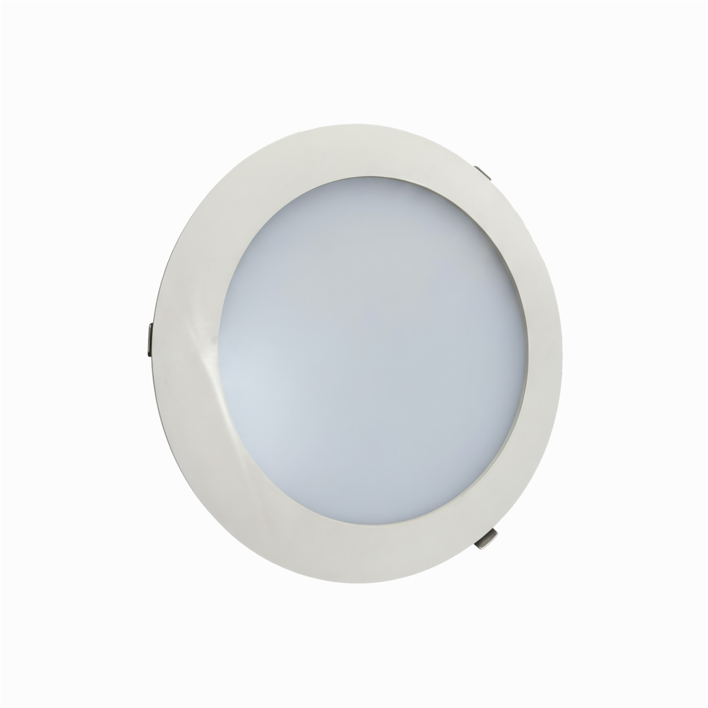

# NexLed Components Reference

Source-derived from:
- `atoms.html`
- `molecules.html`
- `organisms.html`
- `src/nexled.css`

Extraction rule:
- Canonical HTML comes from `<pre><code id="snippet-*">...</code></pre>` blocks.
- Class legitimacy is checked against selectors in `src/nexled.css`.
- Helper classes may appear when required by demo structure or JS behavior.

---

## Source Index

### Atoms
- `buttons` -> `snippet-buttons`
- `badges` -> `snippet-badges`
- `checkboxes` -> `snippet-checkbox`
- `radio-buttons` -> `snippet-radio`
- `hyperlinks` -> `snippet-links`
- `loading` -> `snippet-loading`
- `scroll` -> `snippet-scroll`
- `tooltip` -> `snippet-tooltip`
- `text` -> `snippet-text`

### Molecules
- `accordion` -> `snippet-accordion`
- `announcement-bar` -> `snippet-announcement`
- `breadcrumbs` -> `snippet-breadcrumb`
- `dropdown` -> `snippet-dropdown`
- `file-uploader` -> `snippet-file-uploader`
- `language-selector` -> `snippet-language-selector`
- `List` -> `snippet-spec-list`
- `material-selector` -> `snippet-material-selector`
- `quantity-selector` -> `snippet-quantity`
- `stepper` -> `snippet-stepper`
- `text-field` -> `snippet-text-field`
- `image-carousel` -> `snippet-carousel`
- `drop-full` -> `snippet-drop-full`
- `card` -> `snippet-card`

### Organisms
- `footer` -> `snippet-footer`
- `header` -> `snippet-header-nav`
- `modal` -> `snippet-modal`

---

## Atoms

### Buttons
- Source: `atoms.html` (`#buttons`, `snippet-buttons`)
- Core classes: `btn`
- Variants: `btn-primary`, `btn-secondary`, `btn-ghost`, `btn-danger`, `btn-icon`
- Sizes: `btn-xl`, `btn-lg`, `btn-md`, `btn-sm`
- State hooks: `aria-pressed`, `:disabled`, `[aria-disabled="true"]`

```html
<button class="btn btn-primary btn-xl">Primary XL</button>
<button class="btn btn-secondary btn-xl">Secondary XL</button>
<button class="btn btn-ghost btn-xl">Ghost XL</button>
<button class="btn btn-secondary btn-icon btn-xl" aria-pressed="false">
  <i class="ri-delete-bin-2-line text-icon-xxl"></i>
</button>
```

### Badges
- Source: `atoms.html` (`#badges`, `snippet-badges`)
- Core classes: `badge`
- Variants: `badge-primary`, `badge-success`, `badge-danger`, `badge-neutral`
- Sizes: `badge-lg`, `badge-md`, `badge-sm`, `badge-dot`
- State hooks: `:disabled`, `[aria-disabled="true"]`

```html
<div class="badge badge-primary badge-lg">Primary</div>
<div class="badge badge-success badge-md">Success</div>
<div class="badge badge-danger badge-sm">Danger</div>
<div class="badge badge-neutral badge-dot"></div>
```

### Checkboxes
- Source: `atoms.html` (`#checkboxes`, `snippet-checkbox`)
- Core classes: `checkbox-wrapper`
- Sizes: `checkbox-sm`, `checkbox-md`, `checkbox-lg`
- State hooks: `:checked`, `:disabled`, `[aria-disabled="true"]`, optional `data-state="indeterminate"`

```html
<label class="checkbox-wrapper checkbox-md">
  <span class="relative inline-flex items-center justify-center">
    <input type="checkbox" class="peer">
    <i class="ri-check-line absolute inset-0 flex items-center justify-center leading-none text-white text-icon-md opacity-0 peer-checked:opacity-100 pointer-events-none"></i>
  </span>
  <span class="text-body-sm">Medium</span>
</label>
```

### Radio Buttons
- Source: `atoms.html` (`#radio-buttons`, `snippet-radio`)
- Core classes: `radio-wrapper`
- Sizes: `radio-sm`, `radio-md`, `radio-lg`
- State hooks: `:checked`, `:disabled`, `[aria-disabled="true"]`

```html
<label class="radio-wrapper radio-md">
  <input type="radio" name="radio-md">
  <span class="text-body-sm">Medium</span>
</label>
```

### Hyperlinks
- Source: `atoms.html` (`#hyperlinks`, `snippet-links`)
- Core classes: `link`, `link-inline`, `link-subtle`, `link-text-icon`, `link-navigation`, `link-label`
- State hooks: `.is-disabled`, `[aria-disabled="true"]`, `.is-active`, `[aria-current="page"]`, `.is-visited`

```html
<a href="#" class="link-text-icon" data-demo-link>
  <i class="ri-delete-bin-2-line"></i>
  <span class="link-label">Text + Icons Link</span>
  <i class="ri-arrow-right-line"></i>
</a>

<a href="#" class="link-navigation is-active" aria-current="page">
  <span class="link-label">Navigation Link Active</span>
</a>
```

### Tooltip
- Source: `atoms.html` (`#tooltip`, `snippet-tooltip`)
- Core classes: `tooltip-wrapper`, `tooltip`
- Sizes: `tooltip-xs`, `tooltip-sm`, `tooltip-md`, `tooltip-rich`
- State hooks: shown on `.tooltip-wrapper:hover` and `.tooltip-wrapper:focus-within`

```html
<div class="tooltip-wrapper">
  <button class="btn btn-secondary btn-sm">Standard Hover</button>
  <div class="tooltip tooltip-sm">
    <span class="text-body-sm">Standard component tooltip</span>
  </div>
</div>
```

### Loading Spinner (Extra Demo)
- Source: `atoms.html` (`#loading`, `snippet-loading`)
- Core classes: `spinner-container`, `spinner`, `spinner-track`, `spinner-anim`, `spinner-white`
- State hooks: visual variant via `.spinner-white`

```html
<button class="btn btn-primary h-48 px-24 rounded-xs">
  <div class="spinner spinner-white w-16 h-16">...</div>
  <span>Submitting...</span>
</button>
```

### Scrollbar Utility (Extra Demo)
- Source: `atoms.html` (`#scroll`, `snippet-scroll`)
- Core classes: `custom-scrollbar`, `scrollbar-demo`
- State hooks: `.is-scrolling`

```html
<div class="custom-scrollbar scrollbar-demo h-[calc(100%-24px)] overflow-y-auto">
  ...
</div>
```

### Typography Utility (Extra Demo)
- Source: `atoms.html` (`#text`, `snippet-text`)
- Core classes from `nexled.css`: `text-display`, `text-h1`, `text-h2`, `text-h3`, `text-body-lg`, `text-body`, `text-body-sm`, `text-body-xs`
- Token utility examples in snippet: `text-hero-title`, `text-hero-subtitle`, `text-45px`, `max-w-readable`, `max-w-standard`

```html
<h2 class="text-hero-title font-medium text-black">Suport Nexled</h2>
<p class="text-hero-subtitle font-light text-black max-w-readable">
  ...
</p>
```

---

## Molecules

### Accordion
- Source: `molecules.html` (`#accordion`, `snippet-accordion`)
- Core classes: `accordion`, `accordion-item`, `accordion-trigger`, `accordion-content`, `accordion-body`
- Sizes: `accordion-sm`, `accordion-md`, `accordion-lg`
- State hooks: `aria-expanded`, `.is-open`

```html
<div class="accordion accordion-md">
  <div class="accordion-item">
    <button class="accordion-trigger" aria-expanded="false">
      <span class="text-grey-primary">Medium Accordion</span>
      <i class="chevron-icon ri-arrow-down-s-line text-icon-md text-grey-primary"></i>
    </button>
    <div class="accordion-content">
      <div class="accordion-body">Medium variant content description.</div>
    </div>
  </div>
</div>
```

### Announcement Bar
- Source: `molecules.html` (`#announcement-bar`, `snippet-announcement`)
- Core classes: `announcement-bar`
- Variants: `announcement-bar-standard`, `announcement-bar-floating`
- State hooks: `:disabled`, `[aria-disabled="true"]`

```html
<div class="announcement-bar announcement-bar-floating">
  <p class="text-h2 font-medium">Live Demo: Floating Green Bar.</p>
  <button class="modal-close text-white/60 hover:text-white" aria-label="Close">
    <i class="ri-close-line text-icon-md"></i>
  </button>
</div>
```

### Breadcrumbs
- Source: `molecules.html` (`#breadcrumbs`, `snippet-breadcrumb`)
- Core classes: `breadcrumb`, `breadcrumb-item`, `breadcrumb-separator`, `breadcrumb-link`
- State hooks: `[aria-current="page"]`, link hover/active/focus-visible

```html
<nav aria-label="Breadcrumb Example">
  <ol class="breadcrumb">
    <li class="breadcrumb-item"><a href="#">Home</a></li>
    <li class="breadcrumb-separator"><i class="ri-arrow-right-s-line text-icon-md"></i></li>
    <li class="breadcrumb-item" aria-current="page">UI System</li>
  </ol>
</nav>
```

### Dropdown
- Source: `molecules.html` (`#dropdown`, `snippet-dropdown`)
- Core classes: `dropdown`, `dropdown-trigger`, `dropdown-menu`, `dropdown-item`
- Variants: `dropdown-minimal`
- Sizes: `dropdown-sm`, `dropdown-md`, `dropdown-lg`
- Structural helpers: `dropdown__trigger`, `dropdown__menu`, `dropdown__item`, `dropdown__value`, `dropdown__arrow`
- State hooks: `.is-open`, `[aria-expanded="true"]`, `[aria-disabled="true"]`

```html
<div class="dropdown dropdown-md">
  <button class="dropdown-trigger dropdown__trigger" aria-haspopup="listbox" aria-expanded="false">
    <span class="dropdown__value text-grey-primary">Select an option</span>
    <i class="ri-arrow-down-s-line dropdown__arrow text-icon-md text-grey-primary"></i>
  </button>
  <ul class="dropdown-menu dropdown__menu custom-scrollbar opacity-0 invisible -translate-y-2" role="listbox">
    <li class="dropdown-item dropdown__item" role="option" data-value="option1">Option 1</li>
    <li class="dropdown-item dropdown__item" role="option" data-value="option2">Option 2</li>
  </ul>
</div>
```

### Spec List
- Source: `molecules.html` (`#List`, `snippet-spec-list`)
- Core classes: `spec-list`, `spec-row`, `spec-key`, `spec-value`
- State hooks: `:hover`, `:active`, `:focus-visible`, `[aria-disabled="true"]`

```html
<div class="spec-list">
  <div class="spec-row">
    <span class="spec-key">Brand</span>
    <span class="spec-value">NEXLED</span>
  </div>
</div>
```

### Stepper
- Source: `molecules.html` (`#stepper`, `snippet-stepper`)
- Core classes: `stepper`, `stepper-step`, `stepper-number`, `stepper-divider`
- Structural helpers: `step-item`, `step-circle`, `step-link`
- State hooks: `.is-active`, `.is-done`, `aria-pressed`

```html
<div class="stepper">
  <button class="step-item stepper-step is-active" aria-pressed="true">
    <div class="step-circle stepper-number">1</div>
    <a href="#" class="step-link text-body-lg text-green-primary font-semibold no-underline">Order Details</a>
  </button>
</div>
```

### Card
- Source: `molecules.html` (`#card`, `snippet-card`)
- Core classes: `card`, `card-title`, `card-text`, `card-product`, `card-product-badge`, `card-product-image`, `card-product-body`, `card-product-name`, `card-product-desc`, `card-product-price`, `card-product-actions`
- State hooks: card hover/active/focus-visible and disabled patterns

```html
<div class="card p-24 max-w-sm">
  <h3 class="card-title">Maecenas pharetra</h3>
  <p class="card-text">Lorem ipsum dolor sit amet, consectetur adipiscing elit.</p>
</div>

<div class="card-product max-w-sm">
  <span class="card-product-badge">Best Seller</span>
  
</div>
```

### Text Field
- Source: `molecules.html` (`#text-field`, `snippet-text-field`)
- Core classes: `input-label`, `input`, `input-hint`
- Variants/states: `input-success`, `input-error`, `input-senior`, `input-disabled`

```html
<label for="standardInput" class="input-label">Full Name</label>
<input type="text" id="standardInput" placeholder="Enter your name" class="input">
<p class="input-hint">Example of a standard descriptive input.</p>

<label for="successInput" class="input-label">Success State</label>
<input type="text" id="successInput" value="Valid input data" class="input input-success">
```

### Language Selector (Extra Demo)
- Source: `molecules.html` (`#language-selector`, `snippet-language-selector`)
- Core NexLed classes reused: dropdown stack (`dropdown`, `dropdown-trigger`, `dropdown-menu`, `dropdown-item`)
- Structural helpers: `language-selector-root`, `current-lang-flag`, `arrow-icon`, `dropdown__*`

```html
<div class="dropdown dropdown-sm language-selector-root w-btn-sm">
  <button type="button" class="dropdown-trigger dropdown__trigger justify-center gap-8" aria-haspopup="listbox" aria-expanded="false">
    
    <i class="ri-arrow-down-s-line dropdown__arrow text-icon-sm text-grey-primary arrow-icon"></i>
  </button>
</div>
```

### Material Selector (Extra Demo)
- Source: `molecules.html` (`#material-selector`, `snippet-material-selector`)
- Core classes: `material-item`, `material-thumb`, `material-img`, `label-check`
- State hooks: `.is-selected`

```html
<button class="material-item flex flex-col items-center gap-[14px] bg-transparent border-none" onclick="selectMaterial(this)">
  <div class="material-thumb w-[120px] h-[120px] rounded-[20px] overflow-hidden bg-grey-tertiary/20 shadow-md">
    
  </div>
  <span class="material-label text-base font-medium text-grey-primary">Wood</span>
</button>
```

### File Uploader (Extra Demo)
- Source: `molecules.html` (`#file-uploader`, `snippet-file-uploader`)
- Core classes in `nexled.css`: none dedicated
- Structural helpers: `drop-zone__icon`, `drop-zone__text`

```html
<div id="fileDropZone" class="group relative w-full min-h-[180px] p-8 border-2 border-dashed border-black/10 rounded-2xl bg-white text-center cursor-pointer">
  <input type="file" id="fileInput" class="hidden" multiple>
  <div class="drop-zone__icon text-green-primary text-5xl">
    <i class="ri-file-add-line"></i>
  </div>
</div>
```

### Quantity Selector (Extra Demo)
- Source: `molecules.html` (`#quantity-selector`, `snippet-quantity`)
- Core classes in `nexled.css`: none dedicated
- Structural helpers: `quantity-wrapper`, `qty-btn`, `qty-input`

```html
<div class="quantity-wrapper inline-flex items-center gap-icon-md" data-min="0" data-max="10">
  <button class="qty-btn" aria-label="Decrease quantity">
    <i class="ri-subtract-line text-icon-lg"></i>
  </button>
  <input type="number" class="qty-input text-h3 font-semibold text-center" value="0" readonly aria-label="Quantity">
</div>
```

### Image Carousel (Extra Demo)
- Source: `molecules.html` (`#image-carousel`, `snippet-carousel`)
- Core classes in `nexled.css`: none dedicated
- Structural helpers: `carousel-container` and utility classes
- Note: snippet includes inline `style` for background image in demo.

```html
<div class="carousel-container relative w-full h-[380px] rounded-xl overflow-hidden shadow-btn-default border border-standard border-grey-secondary">
  <div class="absolute inset-0 bg-cover bg-center" style="background-image: url('https://images.unsplash.com/photo-1579033461380-adb47c3eb938?w=800');"></div>
  <button class="absolute left-32 top-1/2 -translate-y-1/2 w-48 h-48 rounded-full bg-white/10 text-white/60" aria-label="Previous slide">
    <i class="ri-arrow-left-s-line text-icon-xl"></i>
  </button>
</div>
```

### Drop Full (Extra Demo)
- Source: `molecules.html` (`#drop-full`, `snippet-drop-full`)
- Core classes in `nexled.css`: none dedicated
- Structural pattern: utility-only composition container

```html
<div class="w-full max-w-4xl bg-white rounded-xl shadow-btn-glow overflow-hidden">
  <div class="flex">
    <div class="w-[200px] bg-grey-tertiary/10 p-16 flex flex-col gap-8">
      <button class="w-full px-16 py-12 rounded-md text-body text-left">Dignissim Turpis</button>
    </div>
    <div class="flex-1 p-24">...</div>
  </div>
</div>
```

---

## Organisms

### Modal
- Source: `organisms.html` (`#modal`, `snippet-modal`)
- Core classes: `modal-overlay`, `modal`, `modal-header`, `modal-title`, `modal-body`, `modal-footer`, `modal-close`
- Variants: `modal-destructive`
- Structural helpers: `modal-container`
- State hooks: `.is-open` (CSS), `.is-visible` (current demo JS), `aria-hidden`, `aria-modal`, `data-modal-target`, `data-close-modal`

```html
<button class="btn btn-primary h-btn-sm w-auto px-24 text-body-sm" data-modal-target="modalStandard">
  Standard Modal
</button>

<div class="modal-overlay" id="modalStandard" aria-hidden="true">
  <div class="modal modal-container max-w-[500px]" role="dialog" aria-modal="true" aria-labelledby="modalTitle1">
    <div class="modal-header">
      <h2 id="modalTitle1" class="modal-title">Lorem ipsum dolor</h2>
      <button class="modal-close" aria-label="Close modal" data-close-modal>
        <i class="ri-close-line text-icon-md"></i>
      </button>
    </div>
  </div>
</div>
```

### Header Nav (Extra Demo)
- Source: `organisms.html` (`#header`, `snippet-header-nav`)
- Core NexLed classes reused: `btn`, `btn-primary` (+ utility/token classes)
- Dedicated organism class in `nexled.css`: none

```html
<header class="bg-white/80 backdrop-blur-xl border border-white/40 shadow-btn-default rounded-2xl flex items-center justify-between px-24 py-20">
  ...
  <button class="btn btn-primary h-btn-sm w-auto px-24 text-body-sm">Get in touch</button>
</header>
```

### Footer (Extra Demo)
- Source: `organisms.html` (`#footer`, `snippet-footer`)
- Dedicated footer class in `nexled.css`: none
- Composition: utility/token classes + semantic structure

```html
<footer class="bg-white rounded-[32px] shadow-[0_20px_40px_rgba(0,0,0,0.08)] overflow-hidden w-full">
  ...
</footer>
```
